<div align="center">

<!-- ============================================================================== -->
<!-- HEADER / BANNER CYBERPUNK & JARVIS INITIALIZATION                                -->
<!-- ============================================================================== -->


<!-- TYPING ANIMATION (JARVIS PROTOCOL) -->
<a href="https://git.io/typing-svg">
  
</a>

<br/>

---

</div>

<!-- ============================================================================== -->
<!-- ABOUT ME / PROFILE OVERVIEW                                                    -->
<!-- ============================================================================== -->

## 🛰️ `// 01. PROTOCOLO DE IDENTIFICAÇÃO (SOBRE MIM)`

```yaml
identity:
  operator: "Murilo de Oliveira Corsulini"
  age: 16
  role: "Estudante & Desenvolvedor de Software"
  institution: "ETEC Pedro Ferreira Alves"
  program: "AMS (Articulação da Formação Profissional Média e Superior)"
  course: "Desenvolvimento de Sistemas"
  location: "São Paulo, Brasil [UTC-3]"
  profile_objective: "Exibir projetos práticos, evolução técnica e soluções inovadoras"
  core_mindset:
    - "Aprendizado contínuo e resolução lógica de problemas"
    - "União de software moderno (Web/Backend) com hardware inteligente (Arduino/IoT)"
    - "Código limpo, organizado e foco na experiência do usuário"
```

> Olá! Me chamo **Murilo Corsulini**, tenho 16 anos e sou estudante de **Desenvolvimento de Sistemas** pela **ETEC Pedro Ferreira Alves** integrado ao programa **AMS**. Sou apaixonado por tecnologia, programação e automação. Utilizo este espaço para compartilhar meus projetos pessoais, experimentos com software e projetos interativos com **Arduino / C#**.

<br/>

<!-- ============================================================================== -->
<!-- ARCHITECTURE & VALUE STREAM DIAGRAM (PlantUML)                                 -->
<!-- ============================================================================== -->

## 🧬 `// 02. FLUXO DE VALOR: MEU APRENDIZADO <-> SUA EMPRESA`

> **Diagrama de Casos de Uso & Valor** ilustrando a conexão entre a minha formação técnica e o impacto gerado para empresas:

```mermaid
%%{init: {'theme':'dark', 'themeVariables': { 'primaryColor':'#161b22', 'primaryTextColor':'#00f0ff', 'primaryBorderColor':'#00f0ff', 'lineColor':'#7928ca', 'secondaryColor':'#0d1117', 'tertiaryColor':'#161b22'}}}%%
flowchart LR
    subgraph DevGroup [👨‍💻 Murilo Corsulini - ETEC AMS]
        A["💻 Full Stack Web<br/>(HTML, CSS, JS, PHP)"]
        B["⚙️ Backend & Lógica<br/>(Java & C#)"]
        C["🗄️ Modelagem & Banco<br/>(MySQL)"]
        D["🤖 Automação & IoT<br/>(Arduino / Sensores)"]
    end

    subgraph SolutionGroup [🚀 Hub de Soluções & Competências]
        S1["📦 Entrega de Software Confiável"]
        S2["⚡ Automação & Integração de Hardware"]
        S3["📊 Estruturas de Dados Otimizadas"]
    end

    subgraph CompanyGroup [🏢 Sua Empresa / Oportunidades]
        E1["📈 Resolução Ágil de Problemas"]
        E2["💡 Inovação & Eficiência Operacional"]
        E3["🎯 Alto Potencial de Crescimento Técnico"]
    end

    A --> S1
    B --> S1
    C --> S3
    D --> S2

    S1 --> E1
    S2 --> E2
    S3 --> E1
    S1 & S2 & S3 --> E3

    style DevGroup fill:#0d1117,stroke:#00f0ff,stroke-width:2px,stroke-dasharray: 4 4
    style SolutionGroup fill:#161b22,stroke:#7928ca,stroke-width:2px
    style CompanyGroup fill:#0d1117,stroke:#00ff66,stroke-width:2px,stroke-dasharray: 4 4
```



<br/>

<!-- ============================================================================== -->
<!-- TECH STACK & ARSENAL                                                           -->
<!-- ============================================================================== -->

## ⚡ `// 03. ARSENAL TECNOLÓGICO EM APRENDIZADO & PRÁTICA`

<div align="center">

<marquee direction="up" scrollamount="3" height="110px" width="100%" onmouseover="this.stop();" onmouseout="this.start();">
  <p align="center">
    
  </p>
</marquee>

</div>

<br/>

<!-- ============================================================================== -->
<!-- FEATURED PROJECTS (CYBER DECK CARDS)                                           -->
<!-- ============================================================================== -->

## 💎 `// 04. PROJETOS EM DESTAQUE (CYBERNETIC LABS)`

<table>
  <tr>
    <td width="50%" valign="top">
      <h3 align="center">⚡ <b>SISTEMA DE AUTOMAÇÃO & IOT</b></h3>
      <p align="center">
        
        
      </p>
      <p align="justify">
        Projeto focado na integração de microcontroladores com software em C#, realizando leitura de sensores, controle de atuadores e comunicação serial interativa.
      </p>
      <p align="center">
        <a href="https://github.com/"><b>[ VER CÓDIGO NO GITHUB ➔ ]</b></a>
      </p>
    </td>
    <td width="50%" valign="top">
      <h3 align="center">🌐 <b>SISTEMA WEB FULLSTACK & CRUD</b></h3>
      <p align="center">
        
        
      </p>
      <p align="justify">
        Aplicação completa com autenticação, regras de negócio e persistência de dados em banco de dados relacional MySQL com interface dinâmica em JS/CSS.
      </p>
      <p align="center">
        <a href="https://github.com/"><b>[ VER CÓDIGO NO GITHUB ➔ ]</b></a>
      </p>
    </td>
  </tr>
</table>

<br/>

<!-- ============================================================================== -->
<!-- TERMINAL OBJECTIVES                                                            -->
<!-- ============================================================================== -->

## 💻 `// 05. TERMINAL DE METAS & DIRETRIZES TÉCNICAS`

```bash
murilo@jarvis-system:~$ cat ~/etec-ams/goals_2026.log

[+] OBJETIVO_01: Consolidar fundamentos de POO avançada em Java e C#.
[+] OBJETIVO_02: Criar projetos de automação com sensores e Arduino integrados a dashboards web.
[+] OBJETIVO_03: Aprofundar modelagem de banco de dados e consultas complexas em MySQL.
[+] OBJETIVO_04: Desenvolver aplicações web robustas integrando PHP, JavaScript moderno e APIs.
[+] OBJETIVO_05: Publicar projetos open-source e expandir portfólio no GitHub.

CURRENT_STAGE: [ETEC AMS - DESENVOLVIMENTO DE SISTEMAS]
STATUS: EXECUTING COMPILED DIRECTIVES... [OK]
```

<br/>

<!-- ============================================================================== -->
<!-- GITHUB METRICS & TELEMETRY                                                     -->
<!-- ============================================================================== -->

## 📊 `// 06. TELEMETRIA DO GITHUB & ESTATÍSTICAS`

<div align="center">

<!-- TROPHIES (Substitua SEU_USERNAME pelo seu usuário do GitHub) -->


<br/><br/>

<!-- STATS & TOP LANGS -->


<br/><br/>

<!-- STREAK STATS -->


<br/><br/>

<!-- ACTIVITY GRAPH -->


<br/><br/>

<!-- SNAKE ANIMATION -->
### 🐍 `// REGISTRO DE ATIVIDADE & CONTRIBUIÇÕES`


</div>

<br/>

<!-- ============================================================================== -->
<!-- SOCIAL / CONTACT HUBS                                                          -->
<!-- ============================================================================== -->

## 🌐 `// 07. CONEXÕES & REDES SOCIAIS`

<div align="center">

[](https://linkedin.com/in/SEU_LINKEDIN)
[](https://github.com/SEU_USERNAME)
[](mailto:seu-email@gmail.com)
[](https://discord.com)

</div>

<br/>

<!-- ============================================================================== -->
<!-- FOOTER                                                                         -->
<!-- ============================================================================== -->

<div align="center">


<p align="center">
  <i>"A melhor maneira de prever o futuro é construí-lo através do código."</i><br/>
  <sub>⚡ Murilo de Oliveira Corsulini • ETEC Pedro Ferreira Alves (AMS)</sub>
</p>

</div>
